<div align="center">

  

  # English Practice Machine Android

  **Open question banks · Your models · Local data · Free practice**

  An Android app for sustained English multiple-choice practice

  <p>
    <a href="README.md">中文</a> ·
    <a href="docs/question-bank-format.md">ESQ format</a> ·
    <a href="docs/update-manifest.md">Update manifest</a> ·
    <a href="LICENSE">GPL-3.0-only</a>
  </p>
</div>

English Practice Machine Android is an independent release line derived from the Windows English Practice Machine. Its promise is simple: import and share the question banks you choose, connect the AI provider you choose, and keep practice fresh with complete passages, shuffled options, and wrong-answer retries instead of memorising answer positions.

## Designed for portrait phones and large tablets

The Android edition is not a shrunken desktop page. It changes information density with the available window width. Large tablet screens use a landscape two-pane layout; phones, narrow windows, and split-screen use the portrait information architecture.

- **Four bottom destinations**: Home, Notes, AI, and Settings. Wrong answers and vocabulary live under Notes; imports, recycle bin, updates, help, and model configuration live under Settings.
- **A bank-aware home page**: switch the active bank at the top, then see only the Listening, Cloze, Reading, and Part B entry points that exist in that bank. Listening is hidden when unavailable. Paper lists show names only; the vocabulary ticker flips to a new group every five seconds.
- **Portrait practice panes**: passage or listening controls above, questions/options below, with independent scrolling and a draggable divider to change the split.
- **Landscape practice panes**: passage/material on the left, questions/options on the right, with a compact listening player. Seeking is locked while the timer is active and enabled otherwise.
- **One theme across orientations**: light mode uses a warm rice-paper fibre texture and dark mode uses a blue-violet oil-painted night sky. Phones and tablets share the same 4K assets with centered cropping, while passages, options, dialogs, and AI messages remain on high-opacity surfaces for legibility. See [the background asset notes](docs/ui-background-assets.md).
- **Compact toolbar**: exit, timer/pause, answer card, and other actions use icon-first controls. The answer card opens from the top; unit and full-paper submission stay at the bottom so option space is not wasted.
- **Notes and AI**: wrong answers follow the active bank; vocabulary is shared. Portrait AI fills the space between the system bar and navigation, keeping only the conversation title, history entry, model selector, and message composer.

## Screenshots

These screenshots come from the current Android portrait build and cover the main path from practice to review, AI conversations, and settings.

### Home and practice

<table>
  <tr>
    <td align="center">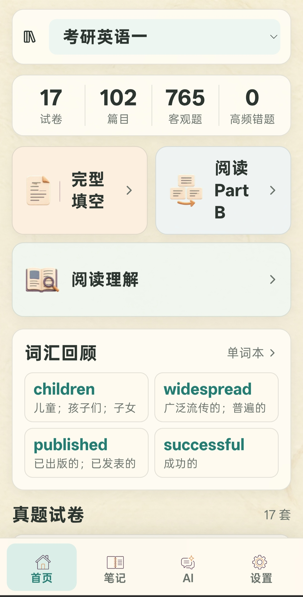<br>Home</td>
    <td align="center">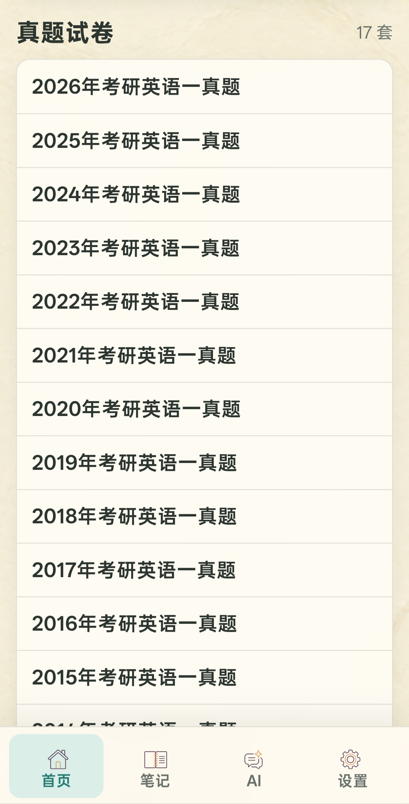<br>Paper list</td>
  </tr>
  <tr>
    <td align="center">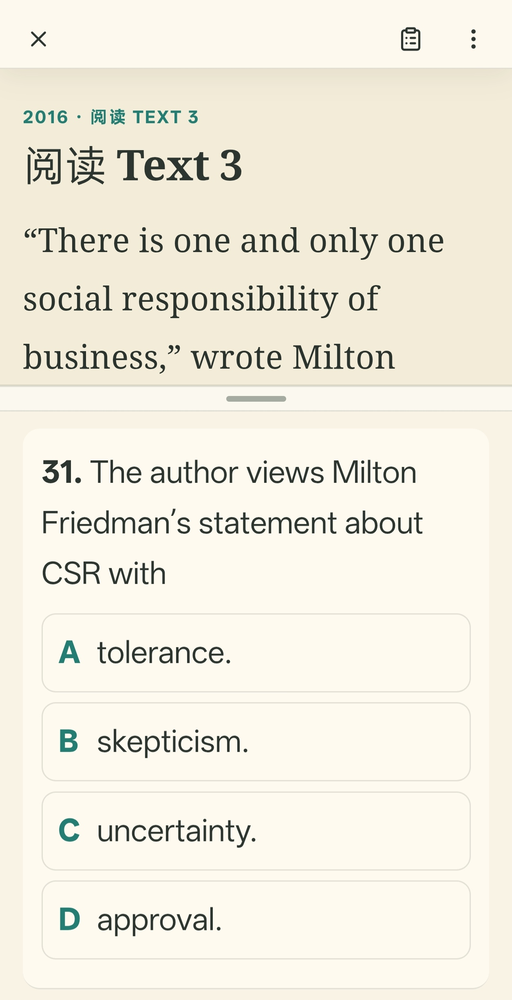<br>Reading practice</td>
    <td align="center">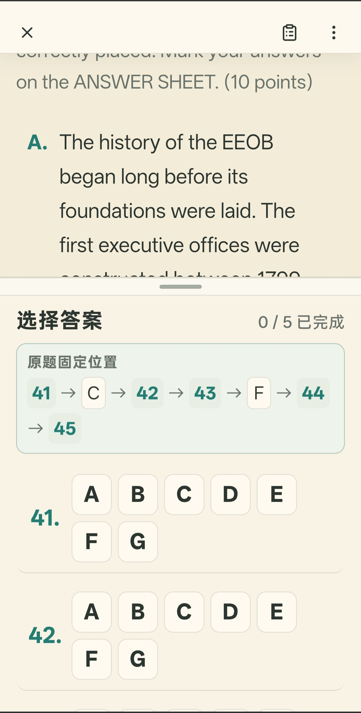<br>Part B ordering</td>
  </tr>
</table>

### Notes and vocabulary

<table>
  <tr>
    <td align="center">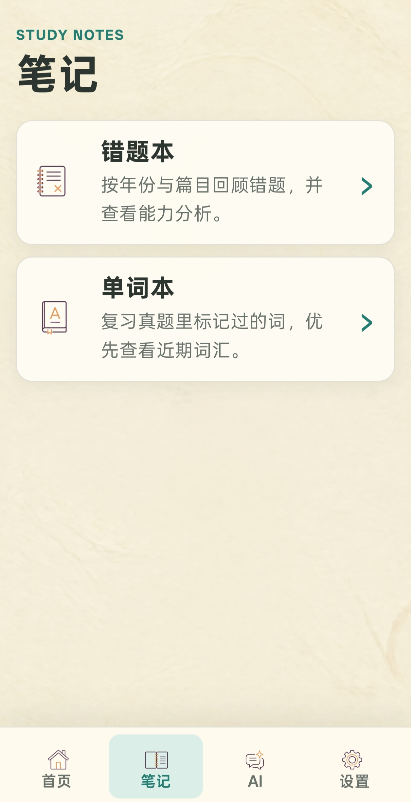<br>Notes</td>
    <td align="center">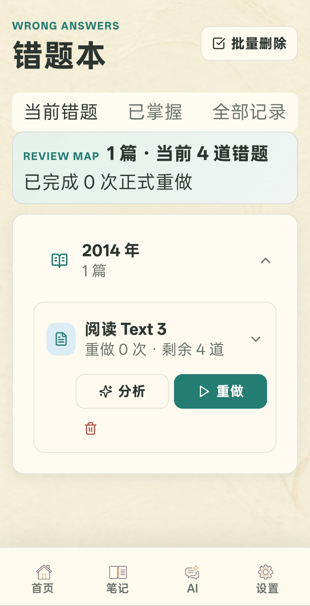<br>Wrong answers</td>
    <td align="center">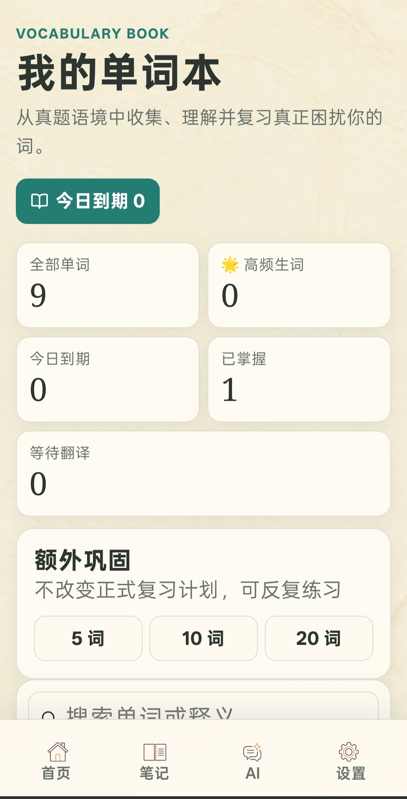<br>Vocabulary book</td>
  </tr>
  <tr>
    <td align="center">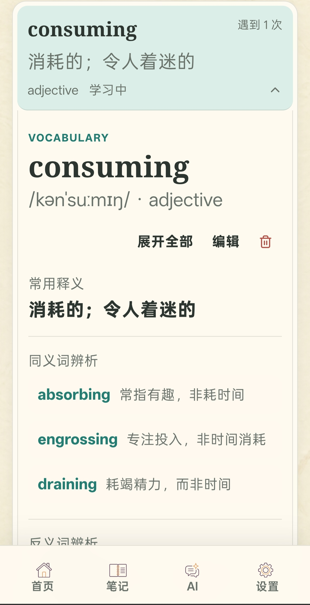<br>Word meaning</td>
    <td align="center">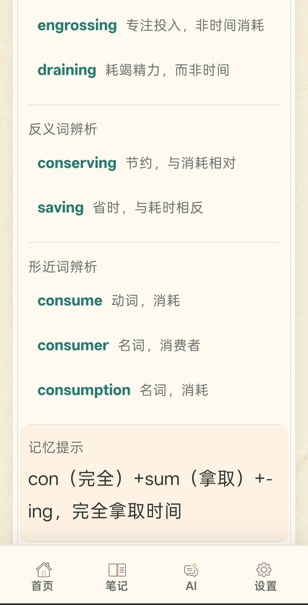<br>Vocabulary relations</td>
    <td></td>
  </tr>
</table>

### AI and settings

<table>
  <tr>
    <td align="center">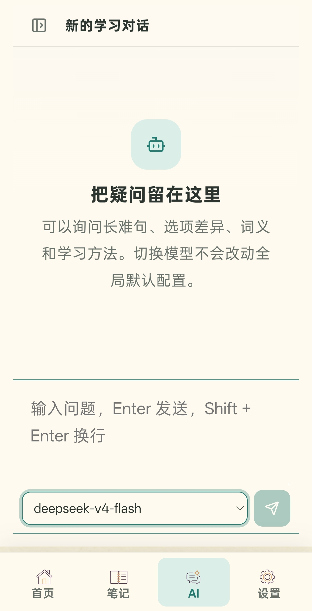<br>AI assistant</td>
    <td align="center">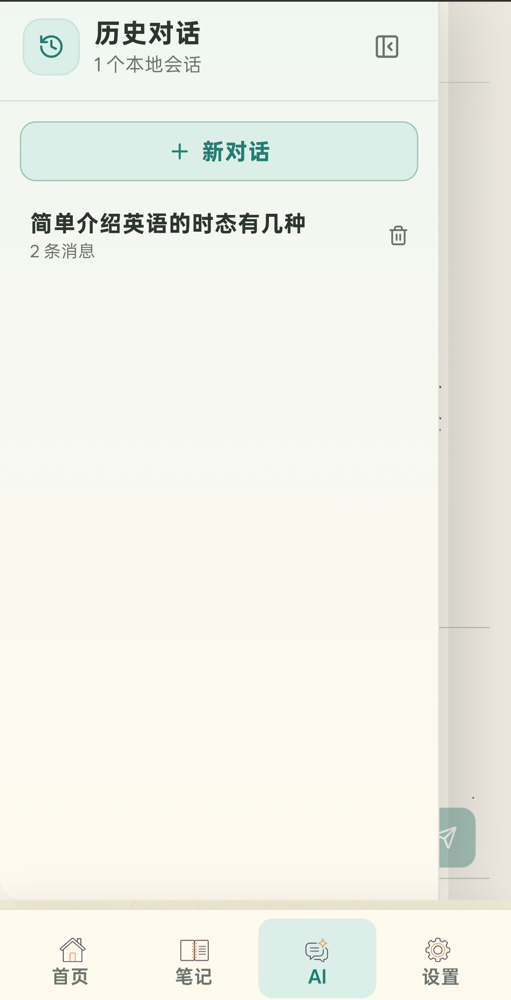<br>Conversation history</td>
    <td align="center">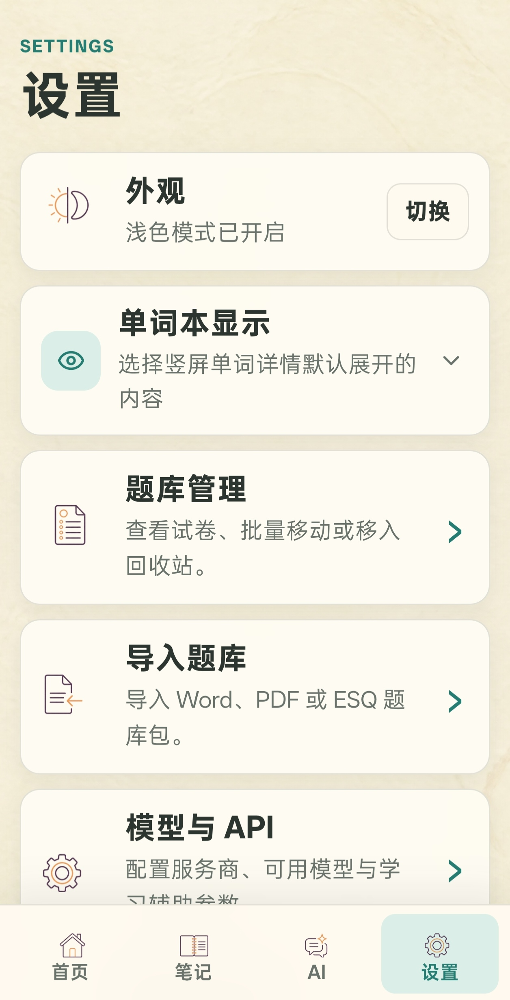<br>Settings</td>
  </tr>
</table>

## Features

### Question banks and import

- English I and English II postgraduate objective-question ESQ banks are bundled for offline first use.
- Import, preview, validate, conflict-check, export, and share ESQ 1.0/1.1 packages.
- Import DOC, DOCX, text-based PDF question/answer files, and MP3/M4A/WAV/OGG listening tracks.
- Optional model assistance aligns question boundaries, numbers, and answer keys. The model edits a structured draft only; the user reviews fields and explicitly approves publication.
- After publication, run AI labeling for this import, a year, or the whole bank. Listening questions are excluded from labeling.
- Scanned or heavily watermarked PDFs without a reliable text layer are rejected with an OCR/manual-processing message.
- The public importer accepts one paper per import and warns before processing; later papers in a multi-paper document are ignored.

### Practice and grading

- Practice by bank and year, or draw a complete unit: one cloze passage, one reading passage, or one Part B material with its questions.
- Postgraduate cloze/reading/Part B, CET word-bank and paragraph matching, and listening objective questions are supported.
- Choose option shuffling before practice; stable internal keys keep grading correct.
- Optional timer with a compact pause control. Incomplete submissions are blocked and navigate to the first unanswered question.
- Unit submission shows unit score and wrong count; whole-paper submission shows the paper score and unit breakdown.
- Listening never reveals the transcript and is excluded from wrong-answer analysis. Audio plays as a complete track and submits as one section; leaving an unfinished section warns that the attempt will not be kept.

### Wrong answers and vocabulary

- Wrong answers follow bank → year → unit and preserve answer history, recent weighting, frequent mistakes, and redo snapshots. Reviewing a mistake does not reveal the correct answer in the question view.
- Analysis reports are cached locally. A unit cannot be analyzed again until its next wrong-question retry is completed; the next report receives the previous wrong-choice snapshot.
- Long-press a word or phrase in a passage, stem, or option to save it. Capture never shows a translation; leaving practice or opening Vocabulary queues pending entries for background translation.
- Ordinary meaning is primary, while contextual meaning sits beside “Seen in the original”. Repeated captures (two or more) receive a `🌟` marker.
- Search, filters, editing, retry, staged review, and optional synonym/antonym/similar-form comparisons are available. Relation panels are off by default and controlled globally in Settings.

### AI and model profiles

- Store multiple API profiles with endpoint, API key, default model, Temperature, enabled state, and model-selector visibility.
- Fetch available models automatically and switch models in the assistant. OpenAI-compatible, Ollama, LM Studio, and similar endpoints can be used.
- AI workflows include study chat, vocabulary translation, wrong-answer advice, import-draft correction, and question-skill labeling.
- Keys are protected by Android Keystore/AES-GCM. Core practice and grading remain offline without AI.

### Updates and privacy

- The updater silently tries the GitHub Release manifest and configured HTTPS mirrors in order. The UI does not expose source URLs or ask the user to choose a site.
- APK size and SHA-256 are checked before handing the file to Android's installer; Android still requires explicit installation confirmation.
- LAN test URLs are not embedded in the public build. A real Release manifest and trusted mirror addresses must be configured before distribution.
- Diagnostics stay local and can be viewed, redacted, copied, exported, or shared through the system share sheet. There is no direct receiver upload.
- ESQ packages contain no API profiles, API keys, chats, practice history, wrong-answer book, or vocabulary book.

## Bundled banks

| Bank | File | SHA-256 |
| --- | --- | --- |
| Postgraduate English I, 2010–2026 | `frontend/public/internal-question-bank.esq` | `ede30fae65f2fbab53c830ba39ef618e5e82f0fa7ebc789d363093c5c1b47075` |
| Postgraduate English II, 2010–2025 | `frontend/public/internal-question-bank-english-two.esq` | `d25ac946fa0543a61beb88eb02664d1e3a55eb819632667603268a6346fe2e83` |

Both packages are candidate-recollection/local-export content and are not official exam publications. Question text, answers, and AI labels do not automatically inherit the code GPL; consult each package's `manifest.json` and [the bundled-bank notes](docs/bundled-question-banks.md) before redistribution.

## Build from source

Requirements: Windows 10/11, Node.js, Corepack/pnpm 11, JDK 21, Android Studio, and Android SDK Platform 36.

```powershell
cd frontend
corepack.cmd pnpm install
corepack.cmd pnpm run build
corepack.cmd pnpm exec cap sync android
cd android
.\gradlew.bat assembleDebug
```

The debug APK is written to `frontend/android/app/build/outputs/apk/debug/app-debug.apk`. Public releases must use the fixed signing certificate, increment `versionCode`, and keep signing material outside the repository. Never commit APK/AAB files, databases, logs, API keys, or signing files.

## Project boundary

Android and Windows have separate databases, version numbers, signing keys, histories, and release schedules. ESQ is the compatibility boundary, not real-time synchronization. Android document import and AI labeling run on the device and depend on device resources and the configured model service. The production web build, Capacitor sync, and Debug APK build pass; broader physical-device validation remains a release prerequisite.

## License and author

Application code is licensed under GNU General Public License v3.0 only (`GPL-3.0-only`). Author: 往事随风k.
